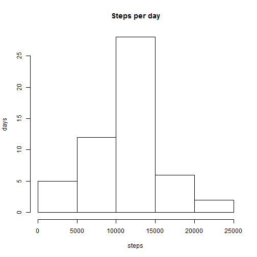
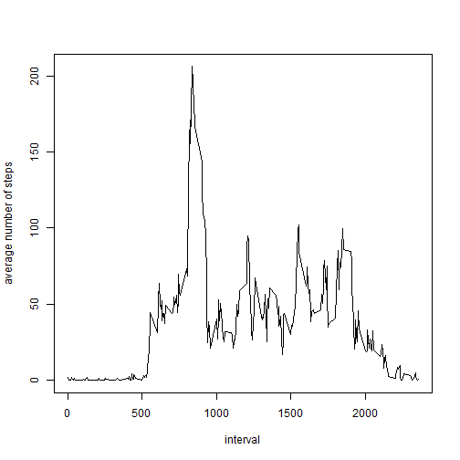
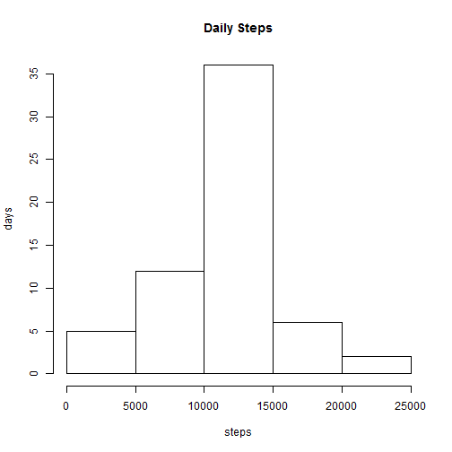
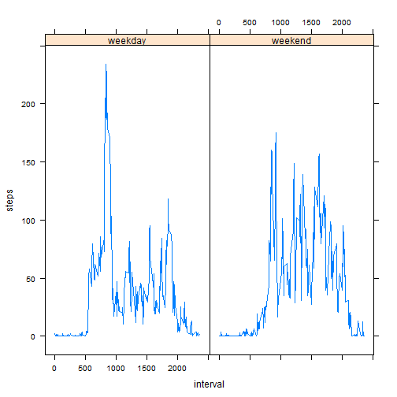

This is an R Markdown document. Markdown is a simple formatting syntax for authoring HTML, PDF, and MS Word documents. For more details on using R Markdown see <http://rmarkdown.rstudio.com>.

When you click the **Knit** button a document will be generated that includes both content as well as the output of any embedded R code chunks within the document. You can embed an R code chunk like this:


```r
## Code for reading the data
## after downloading the zip folder, we will now unzip its contents
unzip("C:/Users/write/Documents/repdata_data_activity.zip")
## reading the file
activity_data <- read.csv("activity.csv")
## to understand the data, let us see the head and tail of the data
head(activity_data)
```

```
##   steps       date interval
## 1    NA 2012-10-01        0
## 2    NA 2012-10-01        5
## 3    NA 2012-10-01       10
## 4    NA 2012-10-01       15
## 5    NA 2012-10-01       20
## 6    NA 2012-10-01       25
```

```r
tail(activity_data)
```

```
##       steps       date interval
## 17563    NA 2012-11-30     2330
## 17564    NA 2012-11-30     2335
## 17565    NA 2012-11-30     2340
## 17566    NA 2012-11-30     2345
## 17567    NA 2012-11-30     2350
## 17568    NA 2012-11-30     2355
```

```r
names(activity_data)
```

```
## [1] "steps"    "date"     "interval"
```

```r
## Total number of steps per day
activity_days <- tapply(activity_data$steps, activity_data$date, sum)
## to plot the histogram
hist(activity_days, main = "Steps per day", xlab = "steps", ylab = "days")
```



``

```r
## mean and median of number of steps per day
stepsmean <- mean(activity_days, na.rm = TRUE)

##mean value is 10766.18867
stepsmedian <- median(activity_days, na.rm = TRUE)

##median value is 10765

## average daily pattern
mean_daily <- aggregate(activity_data$steps, list(activity_data$interval), mean, na.rm = TRUE)
names(mean_daily) <- c("interval", "steps")


plot(mean_daily$interval, mean_daily$steps, type = "l", xlab = "interval", ylab = "average number of steps")
```



```r
##the five minute interval on average across all the days in the dataset contains the maximum number of steps
mean_daily$interval[which.max(mean_daily$steps)]
```

```
## [1] 835
```

```r
##the max number of steps in a five minute interval is 835

#
## differences in patterns between weekday and weekend
activity2 <- activity_data
weekend <- weekdays(as.Date(activity2$date)) %in% c("Saturday", "Sunday")
activity2$daytype <- "weekday"

activity2$daytype[weekend == TRUE] <- "weekend"


activity2$daytype <- as.factor(activity2$daytype)


## lets get the aggregate of the activity2data
meandata <- aggregate(activity2$steps, list(activity2$interval, activity2$daytype), mean, na.rm = TRUE)
names(meandata) <- c("interval", "daytype", "steps")
## t# Code for processing the data
## the total number of missing values in the dataset
sum(is.na(activity_data$steps))
```

```
## [1] 2304
```

```r
## the total number of nas in the activity data is 2304

## to get rid of nas
activity1 <- activity_data
nas <- is.na(activity1$steps)
newactivitydata <- tapply(activity1$steps, activity1$interval, mean, na.rm = TRUE, simplify = TRUE)
activity1$steps[nas] <- newactivitydata[as.character(activity1$interval[nas])]
## check for nas in the activity1 data which is the cleaned data
sum(is.na(activity1$steps))
```

```
## [1] 0
```

```r
## to calculate new mean and median
dailysteps <- aggregate(activity1$steps, activity1$date, sum)
```

```
## Error in aggregate.data.frame(as.data.frame(x), ...): 'by' must be a list
```

```r
mean(dailysteps)
```

```
## [1] 10766.19
```

```r
median(dailysteps)
```

```
## [1] 10766.19
```

```r
## the difference in mean and median after inputting nas is not significant because we have replaced nas with mean

##histogram on cleaned data of steps against each day
hist(dailysteps, main = "Daily Steps", xlab = "steps", ylab = "days")
```




```r
steps_data <- aggregate(steps ~ date, activity1, sum)

barplot(steps_data$steps, names.arg = steps_data$date, xlab = "date", ylab = "steps")
```


```r
##to  plot
xyplot(steps ~ interval | daytype, data = meandata, layout = c(2, 1), type = "l", na.rm = TRUE)
```




